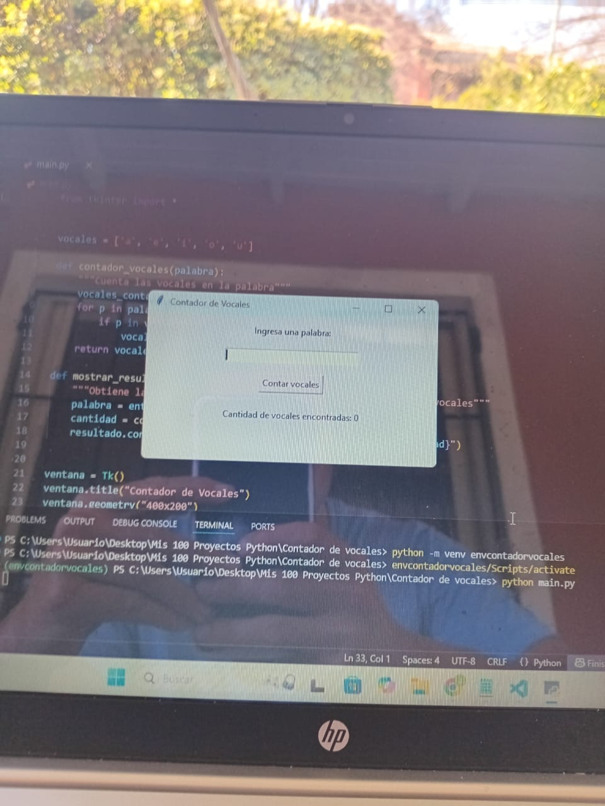
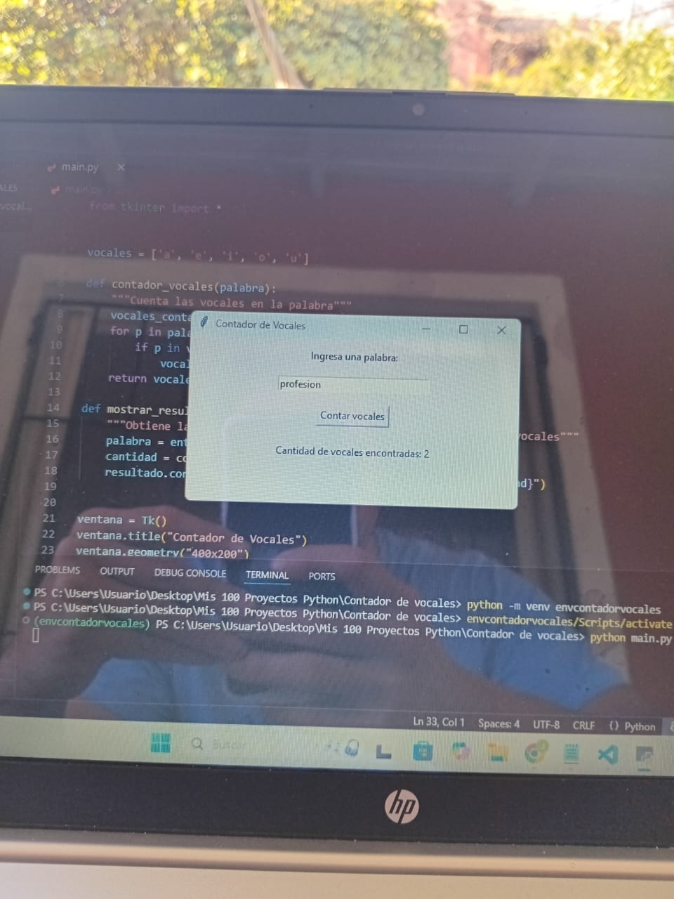

# Vowel Counter GUI

A simple Python Tkinter app that counts the number of vowels in a word or text.

## Description

This Python application provides a graphical interface to count vowels in real-time. Built with Tkinter, it allows users to enter a word or text and instantly see the number of vowels contained. It's a simple and educational tool for practicing Python GUI development.

## Features

- Counts vowels in a word or text
- Simple and clean Tkinter GUI
- Displays results instantly

## Screenshots

